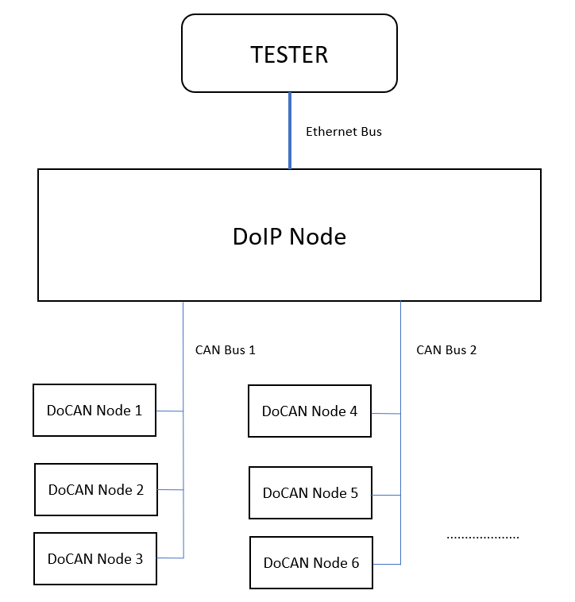
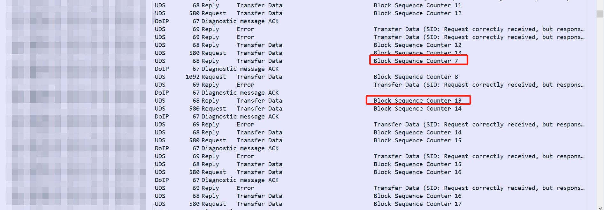

# Yet Another DoIP(YA-DoIP)

This project is a synchronized and non-block-io version of Diagnostic over IP(DoIP) stack. It is cross-platform written in Python3 and totally refers to **ISO-13400 (2019)**. The stack part can do DoIP packet recv, send and parse. With the demo of client, you can furthermore implement a diagnostic tool which entirely confirms to UDS(**ISO-13400 (2019)**).
You can get these features:
1. Diagnostic/Flash of vehicle ethernet ECUs
2. Diagnostic/Flash of DoIP->DoCAN ECUs
3. Parallel flash of Multi-DoIP ECUs
4. Parallel flash of Multiple DoCAN ECUs with a powerful DoIP server:smirk:
5. Plug & Use, with the help of Wireshark maybe you can get rid of expensive devices, e.g. Vector 5640

This project is under MIT LICENCE. If you are interested, you can make PRs or just email me: chenxiao9609@foxmail.com.

## 1. Purpose

I'm currently working for an Automotive OEM. Due to job revelance, I created this project. At the beginning, I searched for some existing handy tools, however; I only found a [synchronized-block-io version of DoIP stack](https://github.com/jacobschaer/python-doipclient/) created by Jacob Schaer on github. It is already enough for a simple client, but for myself **it seems not very scalable and maybe it is not suitable for multi clients**.

Without wheels, I decided to make a reentrant version of non-block-io DoIP stack and I also made clients **supporting parallel flashing ECUs**:smirk:. Meanwhile, I hope we can contribute to open source software in intelligent car industry just like what BMW do.

## 2. Intro

The project has implemented a lightweight, fully compliant with **ISO-13400 (2019)** , synchronized non-blocking-io version of the DoIP protocol stack. It supports multiple clients accessing a single stack and is written in Python 3. YA-DoIP is extremely simple and easy to use, with the core code of the entire stack being less than 200 lines. As for the client part, due to intellectual property and confidentiality reasons related to the server-side flashing knowledge, I won't be open-sourcing everything for now. I will only provide a demo for reference. But trust me, everyone can have fun playing around with it by using the demo I provide based on the standards set by various OEMs.

In line with the classic topology described in ISO13400-2, you can perform parallel diagnostic/flash on different DoIP nodes or sequential diagnostic/flash on DoCAN nodes.

<div align=center></div>

Regarding a tree-like topology diagram similar to the one shown below, you can implement parallel diagnostic/flash for different DoCAN ECUs under DoIP nodes, such as DoCAN Node 1 and DoCAN Node 4 in the diagram.

<div align=center></div>

~~Below is the evidence of parallel flashing supported by this project:~~

<div align=center></div>

**Explanation of Files:**

- **stack.py**: This file contains the core components of the DoIP protocol stack. It supports sending and receiving DoIP data and parsing it. I have already implemented the core parts for the TCP aspect (including Routing Activation, Diagnostic Messages, etc.). The UDP part is pending implementation, but it does not currently affect the overall usability of the stack.

- **messages.py**: This file defines the underlying message formats of the DoIP protocol stack. I obtained these formats from Jacob Schaer's original project and made some slight adjustments. In Jacob Schaer's own words, "*Quoted descriptions were copied or paraphrased from ISO-13400-2-2019 (E).*" Therefore, I reused these formats to avoid reinventing the wheel.

- **1driver_1app_client_demo.py**: This file is a demo that supports parallel operations and works in conjunction with the stack. It implements a basic `DoIPClient` class. By inheriting this class and redefining the necessary functions, you can implement your own functionalities. I'm merely providing a feasible approach to you experts, and I'll explain it in more detail below. Feel free to explore and expand upon it as needed.
- **server.py**: This file contains a basic implementation of a DoIP ECU. To achieve quick implementation, I've used a rather rudimentary approach to handle some routine responses.

## 3. Usage
To see the complete usage of how the client and stack work together, you can refer to the `1driver_1app_client_demo.py` file. In this file, there is a one-to-many mapping between stack objects and client objects. Inside the client implementation, there should be a master client responsible for tasks like DoIP node routing activation.

Feel free to explore `1driver_1app_client_demo.py` for a detailed understanding of how the stack and client interact and how the master client handles tasks related to DoIP node routing activation and other responsibilities.

```python
# initialization
master_client = DoIPClient(target_address=0x1111)
master_client.daemon = True
client = DoIPClient(target_address=0x2222)
client.daemon = True

stack = DoIPStack(client_ip_address="127.0.0.1", server_ip_address="127.0.0.1")
stack.daemon = True
test_present_timer = RepeatTimer(interval=2.5, function=tester_present, args=(client, ))
test_present_timer.daemon = True
master_client._doip_stack = stack
client._doip_stack = stack

# register all the clients
stack.register_master_client(0x1111, client=master_client)
stack.register_client(0x2222, client=client)

master_client.process_software_package()
client.process_software_package()

if stack.connect_edge_node(timeout=0.05) == 0:
    stack._is_edge_node_connected = True
    stack.start()
    master_client.start()
    # maybe you need some condition check here for the next two lines
    client.start()
    test_present_timer.start()

    while True:
        time.sleep(5)
        log.info("Main thread tick...")
        if master_client._current_client_running == False:
            test_present_timer.cancel()
            break
else:
    log.error("EDGE NODE connect failed.")
```

Each client object inherits from the `threading.Thread` object and is registered with the stack through registration functions, creating a one-to-many mapping relationship between the stack and clients. During implementation, you can inherit from the `DoIPClient` object I've provided and override all the callback functions. Alternatively, you can modify the relevant parameters of the stack to achieve additional functionalities you desire. You have the freedom to do what you'd like, just grab the friendly code.

Furthermore, I've also provided suggestions for finite state machines in the demo, such as states for UDS, flashing, message parsers, and more. You can refer to my code to implement your upper-level functionalities.

Feel free to adapt the provided code to your needs and explore the options that best suit your requirements.

```python
class UDSState(IntEnum):
    IDLE = 0
    SENT = 1
    PENDING = 2
    POSITIVE_RESPONSE = 3
    NEGATIVE_RESPONSE = 4
    FUNCTIONAL_COLLECTING = 5


class FlashState(IntEnum):
    IDLE = 0
    EDGE_NODE_ROUTING_ACTIVATE = 1
    F_DEFAULT_SESSION_ON = 2
    # start
    """
        Finite State Machine of ISO 14229 stuff here
    """
    # over
    FLASHED_OK = 3
    FLASHED_FAIL = 4

class Parser:
    def __init__(self):
        self.reset()

    def reset(self):
        self.rx_buffer = bytearray()
        self.protocol_version = 0x00
        self.inverse_version = 0x00
        self.payload_type = 0x0000
        self.payload_length = 0x00000000
        self.payload = bytearray()
        self._state = ParserState.READ_PROTOCOL_VERSION

    def parse(self, data):
        self.rx_buffer += data
        log.debug("parser buffer: 0x{}".format(self.rx_buffer.hex().upper()))
        parsed_list = []

        while len(self.rx_buffer) > 0:
            if self._state == ParserState.READ_PROTOCOL_VERSION:
                self.payload = bytearray()
                if len(self.rx_buffer) >= 1:
                    self.protocol_version = int(self.rx_buffer.pop(0))
                    self._state = ParserState.READ_INVERSE_PROTOCOL_VERSION
                else:
                    break
                
            if self._state == ParserState.READ_INVERSE_PROTOCOL_VERSION:
                if len(self.rx_buffer) >= 1:
                    self.inverse_version = int(self.rx_buffer.pop(0))
                    if self.inverse_version != (0xFF ^ self.protocol_version):
                        log.warning("DoIP HEADER: protocol version && inverse version CAN NOT match. Ignoring......")
                    self._state = ParserState.READ_PAYLOAD_TYPE
                else:
                    break
            
            if self._state == ParserState.READ_PAYLOAD_TYPE:
                if len(self.rx_buffer) >= 2:
                    self.payload_type = int(self.rx_buffer.pop(0)) << 8
                    self.payload_type |= int(self.rx_buffer.pop(0))
                    self._state = ParserState.READ_PAYLOAD_LENGTH
                else:
                    break
            
            if self._state == ParserState.READ_PAYLOAD_LENGTH:
                if len(self.rx_buffer) >= 4:
                    self.payload_length = int(self.rx_buffer.pop(0)) << 24
                    self.payload_length |= int(self.rx_buffer.pop(0)) << 16
                    self.payload_length |= int(self.rx_buffer.pop(0)) << 8
                    self.payload_length |= int(self.rx_buffer.pop(0))
                    self._state = ParserState.READ_PAYLOAD_OPEN
                else:
                    break

            if self._state == ParserState.READ_PAYLOAD_OPEN:
                if len(self.rx_buffer) < self.payload_length:
                    log.info("Current parser wants more data......")
                    break
                else:
                    self.payload += self.rx_buffer[:self.payload_length]
                    self.rx_buffer = self.rx_buffer[self.payload_length:]
                    self._state = ParserState.READ_PROTOCOL_VERSION
                    log.debug("payload_type: {}".format(payload_type_to_message_dict[self.payload_type]))
                    log.debug("After parse, payload: 0x{}".format(self.payload.hex().upper()))
                    parsed_list.append(payload_type_to_message_dict[self.payload_type].unpack(self.payload, self.payload_length))
        
        return parsed_list
```

The link between the stack and the client is established through callback functions for corresponding sending functions. These callback functions can perform operations using `threading.Event()` variables, which act as semaphores. You have the flexibility to perform various actions within these callback functions. Of course, you can also completely redesign the code if you prefer to start from scratch.

Additionally, I've implemented a basic timer class. You can also inherit from this class to implement functionalities such as sending "Tester Present" messages at certain intervals.

```python
class RepeatTimer(Timer):
    def run(self):
        while not self.finished.is_set():
            self.function(*self.args, **self.kwargs)
            self.finished.wait(self.interval)

def tester_present(client):
    message = DiagnosticMessage(source_address=0x0001, target_address=0x0002, user_data=bytes.fromhex("3E80"))
    if client._doip_stack._is_edge_node_connected:
        client._doip_send(message)
        log.info("tester present")
```

## 4. Environment

In theory, you can run the code on any platform that supports Python 3. I developed it using Python 3.9.9 32-bit version, but it should work on other Python 3 versions as well.

## 5. To-Do

1. Complete the UDP implementation.
2. Finish the remaining parts of the TCP implementation.
3. Implement unit testing to ensure the code's robustness and correctness.
4. Consider optimizing the stack's sending queue for better performance.
5. Potentially optimize the DoIP Server Simulator to enhance testing and simulation capabilities.

## 6. MISC

Throughout the process, I've encountered several conveniences and received help from various sources, such as:

- There's a graphically-oriented [DoIP simulator](https://github.com/hiro-telecom-engineer/python-doip) created by a Japanese friend. It can provide an intuitive understanding of the DoIP interaction process, especially for newcomers to it.
- Useful existing libraries such as `hexrec` for ECU file parsing, `xml` for XML file parsing, and Python's built-in powerful logging tool, `logging`, can greatly simplify various aspects of your project.
- The robust network tool, `Wireshark`, can be instrumental in analyzing network communication and debugging.
- Support and encouragement from [my PigB teammate at Huawei](https://gitee.com/zhaoyingzhuo) have surely played a positive role in my project's progress.
- If you find the project useful, feel free to contact me. I'd be happy to treat you to a cup of coffee:coffee:.